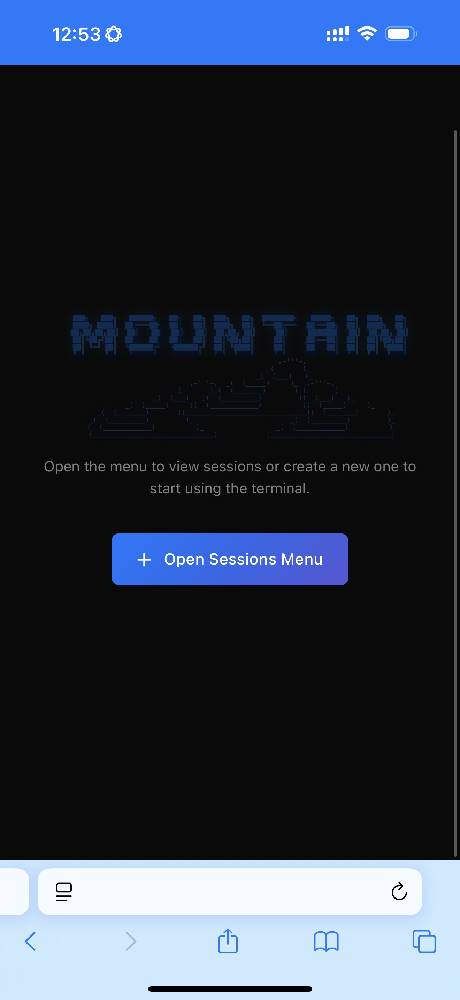
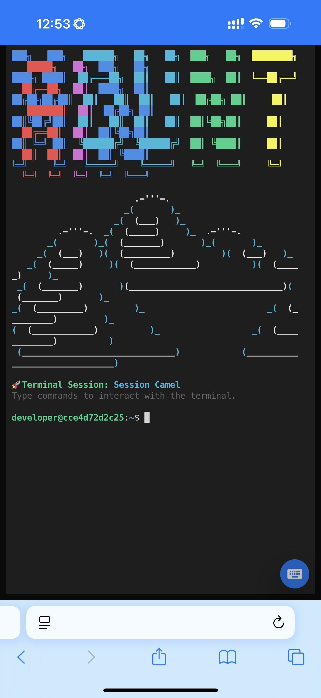
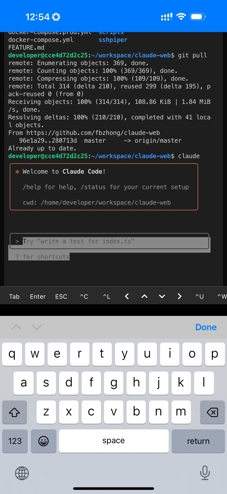

# Claude Web

A web-based remote development environment that allows users to access and control Claude Code and VS Code on remote servers through their browsers.

## Key Features

- 🌐 **Web Terminal**: Full terminal experience based on xterm.js
- 🔒 **Container Isolation**: Independent Docker container for each user
- 💻 **IDE Integration**: One-click connection to VS Code, Cursor, Windsurf
- 🔑 **SSH Access**: Secure SSH connections via SSHpiper
- 🐙 **GitHub Integration**: OAuth integration for repository management
- 📱 **Mobile Support**: Responsive design with virtual keyboard
- 🎯 **Session Management**: Multi-session support with real-time updates
- 🎟️ **Invite System**: Optional invite code registration control

## Mobile Experience

Claude Web is fully optimized for mobile devices, enabling "vibe coding" - coding anywhere, anytime, from your phone or tablet.

<p align="center">
  
  
  
</p>

### Mobile Features

- **Responsive Design**: Automatically adapts to any screen size
- **Virtual Keyboard Toolbar**: Quick access to terminal shortcuts (ESC, Tab, Ctrl+C, etc.)
- **Smart Cursor Tracking**: Keeps your input always visible while typing
- **Touch Gestures**: Native mobile gestures support
- **iOS Optimized**: Full support for iOS keyboards including Chinese input methods
- **Session Management**: Easy switch between multiple terminal sessions

## Quick Start

### Prerequisites

- Docker and Docker Compose
- Node.js 20+ (LTS) and npm (for development)
- PostgreSQL (included in Docker setup)

### Installation

1. **Clone the repository**

```bash
git clone https://github.com/fbzhong/claude-web.git
cd claude-web
```

2. **Configure environment**

```bash
cp .env.production.example .env.prod
# Edit .env.prod file with your configuration
```

3. **Deploy with Docker**

```bash
./deploy.sh
```

## Development Setup

### Local Development

1. **Install dependencies**

```bash
# Install pnpm if not already installed
npm install -g pnpm
```

2. **Setup database**

```bash
# Start PostgreSQL
docker compose up -d postgres

# Run migrations
psql -U claude_web -d claude_web -f scripts/init-db.sql
```

3. **Configure environment**

```bash
# Backend
cd backend
cp .env.example .env
# Edit backend/.env

# Frontend
cd ../frontend
cp .env.example .env
# Edit frontend/.env
```

4. **Start development servers**

```bash
# Terminal 1: Backend (port 12021)
cd backend
pnpm install --unsafe-perm
pnpm run dev

# Terminal 2: Frontend (port 12020)
cd frontend
pnpm install
pnpm start
```

### Project Structure

```
claude-web/
├── backend/          # Fastify API server
├── frontend/         # React application
├── docker/           # Docker configurations
│   ├── dev/          # User development container
│   └── sshpiper/     # SSHpiper container
├── scripts/          # Utility scripts
├── sshpiper/         # SSH proxy runtime data
├── data/             # Database and persistent data
└── docs/             # Documentation
```

## Production Deployment

### Using Docker Compose

1. **Prepare environment**

```bash
# Automated deployment (recommended)
./deploy.sh

# The script will:
# - Check for .env.prod configuration
# - Create necessary directories
# - Generate SSH keys
# - Build and start all services
```

**Manual Configuration (optional):**

```bash
# Copy and configure environment variables
cp .env.production.example .env.prod
vim .env.prod

# Required variables:
# - DATABASE_PASSWORD (generate: openssl rand -hex 32)
# - JWT_SECRET (generate: openssl rand -hex 32)
# - ENCRYPTION_KEY (generate: openssl rand -hex 32)
# - GITHUB_CLIENT_ID & GITHUB_CLIENT_SECRET (manual setup)

# Then run deployment
./deploy.sh
```

2. **Create invite codes (if enabled)**

```bash
# Set REQUIRE_INVITE_CODE=true in .env.prod, then:
docker exec claude-web-backend npm run invite:create -- --count 10
```

3. **Service Management**

```bash
# View logs
docker compose -f docker-compose.prod.yml --env-file .env.prod logs -f

# Stop services
docker compose -f docker-compose.prod.yml --env-file .env.prod down

# Restart services
docker compose -f docker-compose.prod.yml --env-file .env.prod restart
```

### Service Ports

- Frontend: `http://localhost:12020`
- Backend API: `http://localhost:12021`
- SSH: `ssh username@localhost -p 2222`

### HTTPS Configuration (nginx)

```nginx
server {
    listen 443 ssl http2;
    server_name your-domain.com;

    ssl_certificate /path/to/cert.pem;
    ssl_certificate_key /path/to/key.pem;

    location / {
        proxy_pass http://localhost:12020;
        proxy_set_header Host $host;
        proxy_set_header X-Real-IP $remote_addr;
    }

    location /api {
        proxy_pass http://localhost:12021;
        proxy_http_version 1.1;
        proxy_set_header Upgrade $http_upgrade;
        proxy_set_header Connection "upgrade";
    }
}
```

## Usage Guide

### For Users

1. **Register/Login**
   - Visit `http://your-domain.com`
   - Sign up with email and password
   - Enter invite code if required

2. **Using Web Terminal**
   - Click "New Session" to create a terminal
   - Run `claude` to start Claude Code
   - Use like a regular terminal

3. **Connecting IDE**
   - Go to Settings → SSH Keys
   - Upload your SSH public key
   - Click "Open in VS Code/Cursor/Windsurf"
   - Or manually: `ssh your-email@your-domain.com -p 2222`

4. **GitHub Integration**
   - Connect GitHub account in Settings
   - Clone private repos with one click
   - Automatic token management

### For Administrators

#### Managing Invite Codes

```bash
# Create invite codes
docker exec claude-web-backend npm run invite:create -- --count 5

# List codes
docker exec claude-web-backend npm run invite:list

# Delete code
docker exec claude-web-backend npm run invite:delete CODE123
```

#### Monitoring

```bash
# View service status
docker compose -f docker-compose.prod.yml --env-file .env.prod ps

# View logs
docker compose -f docker-compose.prod.yml --env-file .env.prod logs -f

# Monitor resources
docker stats --filter "name=claude-web"
```

#### Maintenance

```bash
# Backup database
docker exec claude-web-postgres pg_dump -U claude_web claude_web > backup.sql

# Update deployment
git pull
./deploy.sh

# Clean up old containers
docker exec claude-web-backend npm run cleanup:containers
```

## Architecture

### Technology Stack

- **Frontend**: React + TypeScript + Material-UI + xterm.js
- **Backend**: Fastify + WebSocket + node-pty/dockerode
- **Database**: PostgreSQL (users, sessions, GitHub connections)
- **Container**: Docker/Podman with isolated user environments
- **IDE Integration**: SSHpiper for Remote-SSH protocol
- **Authentication**: JWT + bcrypt

### Security Features

- Container isolation per user
- SSH public key authentication only
- JWT token authentication
- Encrypted sensitive data
- No command history storage
- Invite code registration control

## Environment Variables

See [docs/ENVIRONMENT_VARIABLES.md](docs/ENVIRONMENT_VARIABLES.md) for complete configuration guide.

Key variables:

- `JWT_SECRET`: JWT signing key
- `ENCRYPTION_KEY`: Data encryption key
- `GITHUB_CLIENT_ID/SECRET`: GitHub OAuth credentials
- `CONTAINER_MEMORY_LIMIT`: Memory limit per user (default: 2g)
- `REQUIRE_INVITE_CODE`: Enable invite system
- `SSHPIPER_DIR`: Base directory for SSHpiper files

## Development

### Running Tests

```bash
# Backend tests
cd backend && pnpm test

# Frontend tests
cd frontend && pnpm test

# All tests
pnpm test
```

### Building for Production

```bash
# Build backend
cd backend && pnpm run build

# Build frontend
cd frontend && pnpm run build

# Build all
pnpm build

# Build Docker images
docker compose -f docker-compose.prod.yml build
```

### Contributing

1. Fork the repository
2. Create your feature branch (`git checkout -b feature/amazing-feature`)
3. Commit your changes (`git commit -m 'Add amazing feature'`)
4. Push to the branch (`git push origin feature/amazing-feature`)
5. Open a Pull Request

## Documentation

- [CLAUDE.md](./CLAUDE.md) - Project decisions and technical details
- [FEATURE.md](./FEATURE.md) - Feature requirements
- [Environment Variables](./docs/ENVIRONMENT_VARIABLES.md) - Configuration guide

## License

MIT License - see [LICENSE](LICENSE) file for details

## Support

- Issues: [GitHub Issues](https://github.com/fbzhong/claude-web/issues)
- Discussions: [GitHub Discussions](https://github.com/fbzhong/claude-web/discussions)
